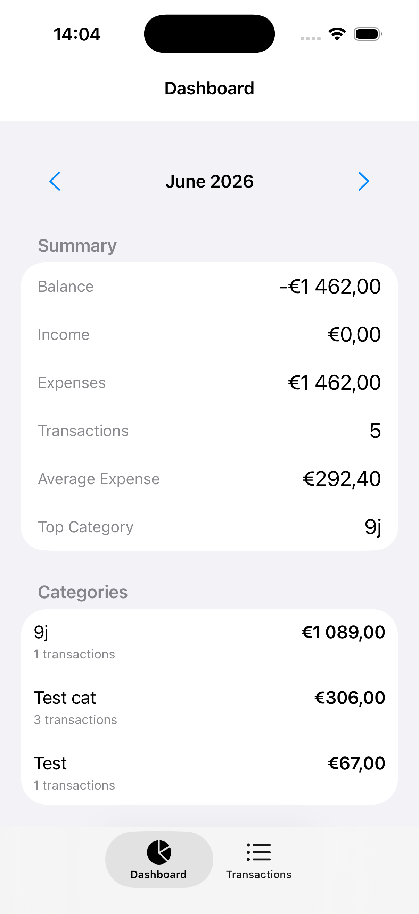
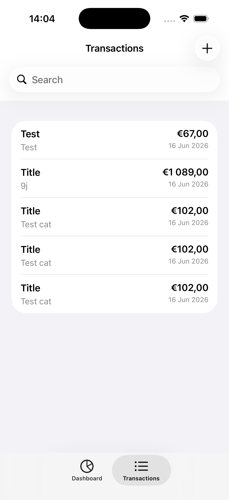
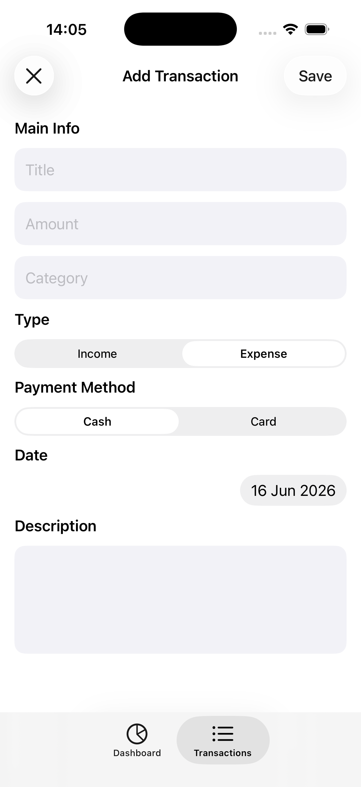
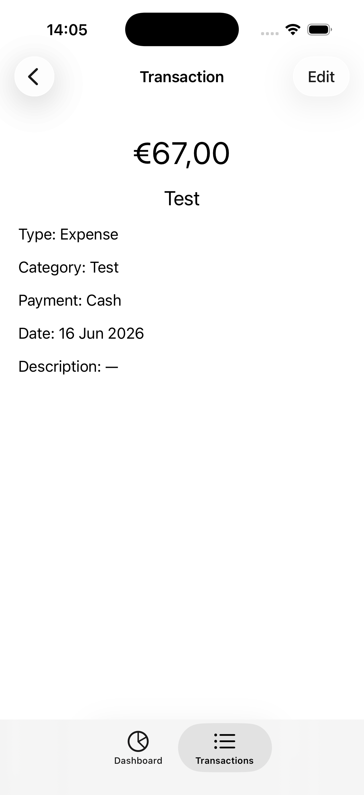

# FinAvsiUIKit

<div align="center">


Personal Finance Tracker built with UIKit and Core Data.

</div>

---

## Screenshots

| Dashboard | Transactions |
|-----------|-------------|
|  |  |

| Add Transaction | Transaction Details |
|-----------|-------------|
|  |  |

---

## Features

- Add income and expense transactions
- Edit existing transactions
- View transaction details
- Track personal finances
- Category-based analytics
- Monthly financial overview
- Local data persistence
- Modular architecture
- Unit and UI testing

## Tech Stack

- Swift 5.10
- UIKit
- Core Data
- SnapKit
- MVVM
- Coordinator / Router Pattern
- Auto Layout
- XCTest

## Architecture

```text
FinAvsiUIKit
├── App
│   ├── AppCoordinator
│   ├── DependencyContainer
│   └── Application Setup
│
├── Core
│   ├── CoreData
│   ├── Services
│   ├── Navigation
│   ├── Components
│   └── Extensions
│
├── Features
│   ├── Dashboard
│   ├── Transactions
│   ├── TransactionDetails
│   ├── AddTransaction
│   └── EditTransaction
│
├── Models
└── Resources
```

### Architectural Principles

- Feature-first structure
- Dependency Injection
- Separation of Concerns
- Reusable UI Components
- Testable Business Logic

## Core Data

Transactions are stored locally using Core Data.

Supported operations:

- Create transaction
- Read transaction
- Update transaction
- Delete transaction
- Filtering and sorting

## Analytics

The Dashboard provides:

- Total balance
- Monthly income
- Monthly expenses
- Transaction statistics
- Category breakdown

## Testing

Included:

- Unit Tests
- UI Tests

Examples:

```text
AnalyticsServiceTests
TransactionCoreDataServiceTests
```

## Getting Started

### Requirements

- macOS
- Xcode 16+
- iOS 17.6 SDK

## Author

**Arsenii Dorogin**

---

Built with UIKit, Core Data and Clean Architecture principles.
